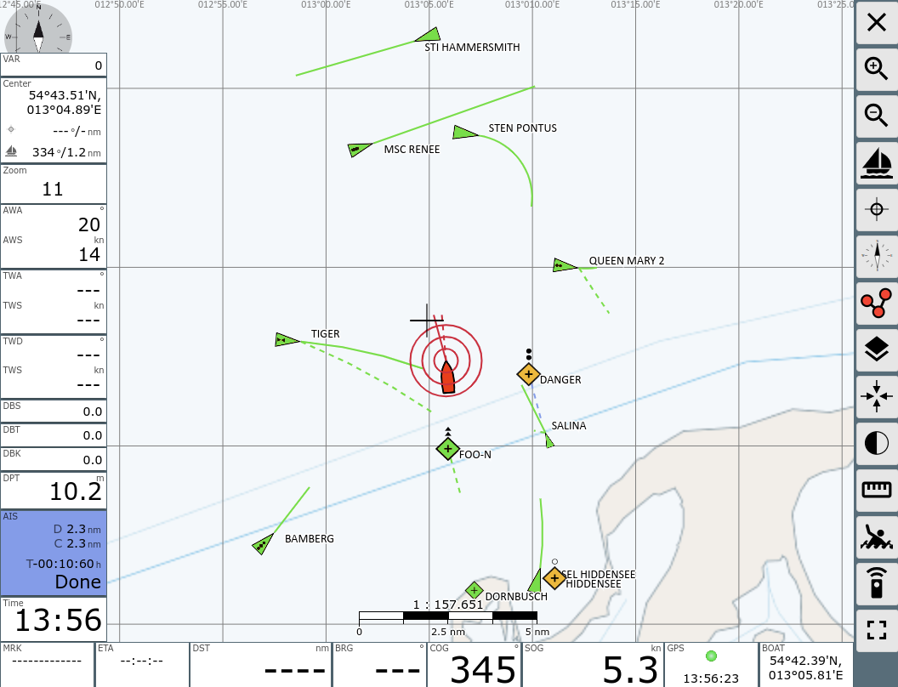

# Simple NMEA ship simulator

This is a simple NMEA based ship simulator used to generated test data AvNav, SignalK, OpenCPN, ... It can be used for testing or showcasing these applications.

It simulates a ship by tracking its state (position, heading, speed, ...)
and the state of the environment (wind, current, depth) and integrating its motion over time.
The speed of the ship is calculated from polar data and wind, if sailing mode is enabled.
The speed of the simulation can be increased using the time factor.

The script listens on port 6000/TCP and serves NMEA sentences containing data as they would have been acquired by the ship's sensors. There is some noise added to the data to make it look more realistic.

It also accepts RMB/APB sentences on the same TCP connection and will steer the supplied bearing.

It also send AIS data to simulate other ship that appear as AIS targets on the plotter.

AvNav with simulated data

